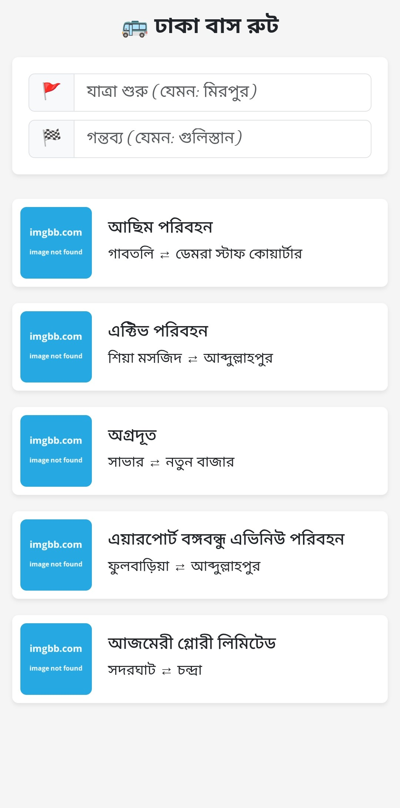
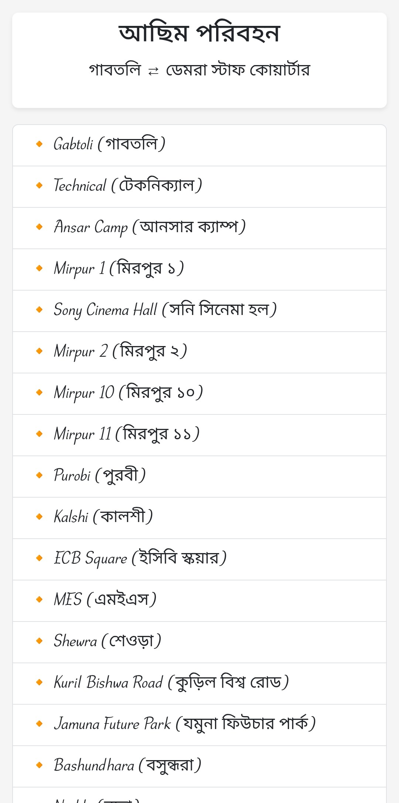

## 🚌 ঢাকা বাস রুট ওয়েব অ্যাপ

একটি মোবাইল-ফ্রেন্ডলি ওয়েব অ্যাপ যেখানে আপনি সহজেই বাস রুট খুঁজে পেতে পারেন। শুরু এবং গন্তব্য স্টেশন টাইপ করলেই মিলবে সংশ্লিষ্ট রুটগুলোর তালিকা।


## 🌐 লাইভ প্রজেক্ট

👉 [লাইভ দেখুন](https://mr-masudrana.github.io/bus-routes/)  


## 📦 ফিচারসমূহ

- 🔎 স্টেশন অনুযায়ী রুট ফিল্টারিং
- ✅ অটো-সাজেস্ট (Auto-suggestion)
- 🔁 ইনপুট রিসেট বাটন
- 📱 সম্পূর্ণ মোবাইল রেসপন্সিভ
- 💾 Progressive Web App (PWA) সাপোর্ট
- 🔗 প্রতিটি রুটের জন্য ডেডিকেটেড stoppage পেইজ


## 📷 স্ক্রিনশট





## 📁 ফোল্ডার স্ট্রাকচার
```

/
├── index.html 
├── stoppage.html 
├── main.js 
├── script.js 
├── routes.json 
├── style.css 
├── manifest.json 
├── service-worker.js 
├── LICENSE
├── README.md 
└── icons
    ├── icon-192.png
    └── icon-512.png
```


## ⚙️ ব্যবহৃত টেকনোলজি

- HTML5
- CSS3
- Bootstrap 5
- JavaScript (Vanilla JS)
  

## 🛠️ ইনস্টলেশন ও রান করার নিয়ম

1. এই রিপোজিটোরি ক্লোন করুন:
   ```bash
   git clone https://github.com/mr-masudrana/dhaka-bus-route-app.git

2. কোড এডিটর (যেমন VS Code) দিয়ে ওপেন করুন।


3. সরাসরি index.html ওপেন করলেই চলে।


4. PWA ফিচার দেখতে চাইলে Live Server বা লোকাল সার্ভার ব্যবহার করুন:


## 🗂️ ডেটা ফরম্যাট (routes.json)
```

[
  {
    "id": 1,
    "name": "গাজীপুর পরিবহন",
    "from": "গাজীপুর",
    "to": "গুলিস্তান",
    "image": "images/bus1.jpg",
    "stoppages": ["গাজীপুর", "চৌরাস্তা", "টঙ্গী", "বনানী", "গুলিস্তান"]
  },
  {
    "id": 2,
    "name": "টঙ্গী পরিবহন",
    "from": "টঙ্গী",
    "to": "মতিঝিল",
    "image": "images/bus2.jpg",
    "stoppages": ["টঙ্গী", "বনানী", "গুলিস্তান", "মতিঝিল"]
  },
  ...
]
```


## 🙌 কৃতজ্ঞতা

এই অ্যাপটি তৈরি করতে ওপেন সোর্স লাইব্রেরি ও ফ্রেমওয়ার্কের সহযোগিতা নেওয়া হয়েছে, যেমন Bootstrap।


## 📄 লাইসেন্স

এই প্রজেক্টটি [MIT লাইসেন্স](LICENSE) এর অধীনে উন্মুক্ত।


**Made with ❤️ for Dhaka commuters.**

---
